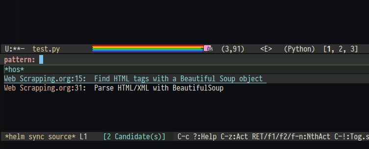

# org-recipes - A code snippet manager with Org and Helm #

This package collects code snippets under the inner-most Org heading. In the
context of this package, such an Org heading is called a `Recipe`. It provides
the following features:

- List all Org headings with at least a code snippet. 

- Each entry can be visited for viewing.

- Insert code from a recipes into the current buffer, or a specific file if the
code block explicitly specifies. The description text is stripped and all code
snippets are concatenated into a single snippet and then it is insert into
current buffer.

- Compose recipes to generate code all at once. 

The snippets are retrieved by scanning the file list in `hos-org-file-list`. If
`org-wiki` is available, it automatically retrieves the list from `org-wiki`.

## Example ##

Suppose we have an org file with the following snippets:

```org
* Python
** Recipes
*** Find HTML tags with a Beautiful Soup object
API:

#+BEGIN_SRC python
  findAll(tag, attributes, recursive, text, limit, keywords)
  find(tag, attributes, recursive, text, keywords)
#+END_SRC

Example:

#+BEGIN_SRC python
     .findAll({"h1","h2","h3","h4","h5","h6"})
     .findAll("span", {"class":"green", "class":"red"})
     .findAll(text="the prince")
#+END_SRC

*** Parse HTML/XML with BeautifulSoup
1. Get the HTML structure of a URL:
   #+BEGIN_SRC python
     html = urlopen("http://en.wikipedia.org"+articleUrl)
   #+END_SRC

2. Use BeautifulSoup to parse:
     #+BEGIN_SRC python
       bsObj = BeautifulSoup(html, "lxml")
     #+END_SRC

3. Then, retrieve any data with Python e.g. regex:

#+BEGIN_SRC python
  bsObj.find("div", {"id":"bodyContent"}).findAll("a",href=re.compile("^(/wiki/)((?!:).)*$"))
#+END_SRC

```

Then, running the command `org-recipes` will display it like this:



Finally, pressing `C-c i` inserts the raw code under a heading:

```python
findAll(tag, attributes, recursive, text, limit, keywords)
find(tag, attributes, recursive, text, keywords)
.findAll({"h1","h2","h3","h4","h5","h6"})
.findAll("span", {"class":"green", "class":"red"})
.findAll(text="the prince")
```

## Why another snippet tool? ##

Have you ever encountered this recurring pattern when writing code:

- You learned about the usage of a particular complex API; or, you happen to
  read an interesting piece of code in an open source project that you believe
  can be reused for the future; or you simply store common code snippets that is
  used everywher e.g. code related to get command line options, code that
  open/close threads/processes...
  
- As time passes, you forgot most of the knowledge what you acquired today. So,
  you store it in some sort of storage, e.g. a plain file, a Markdown file, a
  plain source file with comments, etc,.
  
- However, as you accumulate many little snippets over the year, it is becoming
  more and more time consuming to search and retrieve the necessary snippets.
  Sometimes, it is faster just to type into the web browser that is always
  opened.
  
- Once you retrieve the correct snippets, you want to copy and paste it into the
  main working buffer to start modify to suit the problem at hands. However, the
  snippets might not be free: a snippet can be divided into different sections,
  each with its own description to quickly remind you what this code snippet does.
  
- You tediously copy/paste parts of a code snippet scattered in its file.

This package automates the above process. How
about [yasnippet](https://github.com/joaotavora/yasnippet)? Despite being
similar, this package solves a different problem: it is a snippet manager
leveraged by the powerful `org-mode`, while `yasnippet` is a templating system.
In my opinion, yasnippet is best for creating snippets of language syntaxes e.g.
templates for `if`, `while`... syntaxes in C, Java. 

On the other hand, in `org-recipe`, each recipe can contain a code snippet
similar to yasnippet and more: the descriptive text that gives the context of
the code, which means everything that Org supports! By managing code snippets in
such a way, users can create their personal code wiki, but the relevant source
code in the wiki can immediately appear in the current working buffer, as
demonstrated in the `Example` section.

If you use [org-wiki](https://github.com/caiorss/org-wiki), all the wiki files
are automatically used.

## Usage ##

### Recipe format ###

Each recipe is an Org heading, with code blocks in it:

```org
* Recipe heading

This is a code block for inserting in the current working buffer:

#+begin_src python
print("Hello world")
#+end_src

This code block is also inserted in the current buffer:

#+begin_src python
print("Another hello world")
#+end_src

This is a code block for inserting in a file, as specified by :file parameter:

#+begin_src python :file "test.py"
print("File hello world")
#+end_src
````

### Command: `org-recipes` ###
Run the command `org-recipes` to get all Org headings with snippets. Then, you can either:

- Run persistent action to view the snippet.
- Press `C-c i` to insert the tangled source code in a heading.

### Command: `org-recipes-dwim` ###

A command to expand code based on the object at point. An object can either be:

- A recipe name: in this case, the code snippet from the recipe with the name is
  inserted into theh current buffer, or a file (if a code snippet specifies).

- A list that is a collection of multipole recipes: in this case, code snippets
  from all recipes are collected and inserted into current buffer (if a code
  snippet specifies).


## Future Plan ##

### View aggregated recipe headlines ###

A recipe can be as simple as a symbol. In this case, viewing it from the Helm
interface suffices. However, if it is a list of symbols, then the headline of
each recipe, which corresponds to a symbol, should be aggreated and displayed in
a buffer.

For example, suppose we have the following aggregated recipe: `(OpenGameProcess ReadGameObject MonitorGameObject)`. The
Org headlines for each inner recipe then is:

- `OpenGameProcess`:

    > Use `OpenProcess` API call to open a Windows process, with debug priviledge.

- `ReadGameObject`:

    > Sample snippet to read game object in memory.

- `MonitorGameObject`: 

    > A thread that constantly checking game object and signal at necessary changes.
    
### View aggregated content of code snippets

Since we can view the summary (by collecting appropriate Org headlines) of a
list of recipes, it should also be possible to collect an aggregated content of
each recipe.

### Add Execute block ###

When encounter this block:

```org
#+begin_execute
.... shell commmands...
#+end_execute
```

The shell commands between `#+begin_execute` and `#+end_execute` should be
executed. It is useful to prepare the environment for code to be inserted. For
example, a code snippet might specify a file in a specific directory to be
inserted. The shell commands in the `Execute` block can help to create these
directories and files.

### Composite Recipe ###

An Org headline should be able to specify a list of existing recipes as its
content. For example:

```org
* Server program

#+begin_recipe
(PrepareSocket Bind Open Listen Process CloseSocket)
#+end_recipe
```


### Integrate with Yasnippet ###

It should be possible to use Snippet block for generating code:

```org
#+begin_src Snippet
... Yasnippet content ...
#+end_src
```

When encountered with such code block, `org-recipes` should expand in the same
manner as Yasnippet expands.
